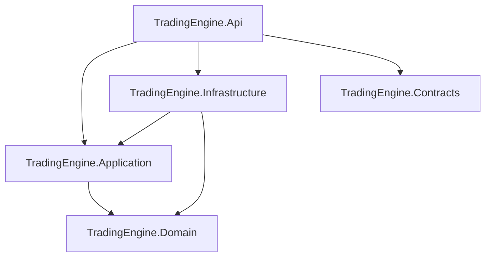

# Solution boundaries and dependency rules

The solution uses Hexagonal Architecture pragmatically. Domain and Application form the reusable core. HTTP is a driving adapter; persistence and external integrations will be driven adapters in Infrastructure. The API project is the composition root.

## Project responsibilities

| Project | Responsibility | Allowed production-project references |
| --- | --- | --- |
| `TradingEngine.Domain` | Entities, value objects, enums and invariants | None |
| `TradingEngine.Application` | Use-case orchestration and use-case-specific ports | Domain |
| `TradingEngine.Infrastructure` | Driven adapters implemented by later stories | Application, Domain |
| `TradingEngine.Contracts` | Stable HTTP and message DTOs | None |
| `TradingEngine.Api` | HTTP driving adapter and composition root | Application, Infrastructure, Contracts |

Contracts are transport-facing types rather than domain types. Domain and Application do not reference Contracts, so transport versioning cannot leak into the core.

## Application conventions

- Organise use cases as small vertical slices under a capability folder, for example `WatchedInstruments/Register`.
- Give each use case a command and a handler. Add a use-case-specific port only when the use case needs an external capability.
- Do not add a generic repository or mediator abstraction without a demonstrated need.
- Application reads the current time through NodaTime `IClock`. It passes the resulting `Instant` into Domain methods explicitly.
- Infrastructure will implement the ports. This story intentionally includes no persistence implementation.

## Domain conventions

- Aggregates expose ordinary .NET primitives rather than per-field wrapper types.
- Absolute timestamps are NodaTime `Instant` values.
- Domain methods never read a system clock.
- State transitions reject invalid or meaningless changes and reject timestamps earlier than the latest recorded change.
- Expected validation and state-transition rejections return `Result` outcomes rather than throwing.
- Sampling intervals are plain seconds. Provider-specific rate-limit mappings belong outside Domain.

## Expected failures and Results

`TradingEngine.Domain.Results` provides a small package-free outcome model used by Domain and Application: `Result`, `Result<T>`, `Error` and `ErrorType`. No Result library or mediator package is introduced.

- Return a failed `Result` for expected outcomes: invalid user or domain data, invalid state transitions, duplicate or conflicting changes and missing expected resources.
- Throw for unexpected outcomes: SQL, network and runtime failures, `OperationCanceledException`, corrupt persisted XML or database state, missing configuration, and programming defects such as null arguments or impossible internal states.
- A failed `Result` carries exactly one `Error`. A successful `Result<T>` exposes a non-null `Value`; reading `Value` on a failure is programmer misuse and throws `InvalidOperationException`.
- An `Error` has a stable machine-readable `Code`, a public-safe `Description` and an `ErrorType` classification. Codes use lowercase dotted snake_case segments, for example `watched_instrument.symbol_required` or `chart_analysis.duplicate_zone_id`.
- `ErrorType` currently supports `Validation`, `Conflict` and `NotFound`. A later API adapter will map them to Problem Details: `Validation` to 400, `Conflict` to 409 and `NotFound` to 404. Unexpected failures and cancellation remain exception-based and are never converted into Results.
- Cohesive catalogues such as `WatchedInstrumentErrors` and `ChartAnalysisErrors` hold the complete `Error` definitions for their area. Per-type rule enums are not used.
- At the Infrastructure XML boundary, a failed Domain `Result` during deserialization is translated into `InvalidDataException` carrying the stable error code. Malformed or corrupt persistence XML is never converted into an Application validation `Result`, because clients do not submit persistence XML.

## Monitoring-rule definitions

- A relational monitoring-rule revision owns the business revision number, lifecycle state, effective interval, creation metadata and concurrency state.
- Its variable chart-analysis definition is stored as canonical XML and mapped to a validated Domain model by an Infrastructure adapter.
- The XML persistence schema is independent of versioned HTTP and message contracts. Clients send transport DTOs and do not construct persistence XML.
- Price observations, signals, risk decisions and orders are separate records rather than mutable state inside the definition.
- Effective and superseded definitions are immutable. A changed definition is written only as a new draft business revision.
- Generic schema and synthetic examples are public-safe. Real definitions, meaningful parameters and strategy or execution logic remain private.

See [Chart-analysis definition XML](chart-analysis-definition-xml.md) for the canonical contract.

## Instrument identification

`WatchedInstrument` is a straightforward aggregate with ordinary properties:

| Property | Meaning |
| --- | --- |
| `Id` | Stable internal `Guid` identity. Must not be `Guid.Empty`. |
| `Symbol` | Instrument ticker or symbol. Trimmed, uppercased, at most 64 characters, no whitespace. |
| `Exchange` | Exchange or venue code where the instrument is quoted. Required, trimmed, uppercased, at most 20 characters; ASCII letters, digits, periods, hyphens and underscores. |
| `QuoteCurrency` | Currency the instrument is quoted in. Required, trimmed, uppercased, 3 to 10 ASCII letters or digits, covering fiat codes such as `GBP` and `USD` and crypto quote codes such as `USDT` and `USDC`. |
| `MonitoringState` | `Configured` or `Monitored`. Drives the start/stop monitoring transitions. |
| `SamplingIntervalSeconds` | Price-sampling cadence in seconds, from 1 through 3600 inclusive. |
| `CreatedAt` | `Instant` the instrument was registered. |
| `LastChangedAt` | `Instant` of the latest recorded change. Change timestamps earlier than this are rejected. |

- `Id` is the stable internal identity. The future persistence business key is `Exchange` + `Symbol` + `QuoteCurrency`.
- Conceptual examples: a stock as `LLOY` / `XLON` / `GBP`; crypto as `BTC` / `ETORO` / `USD` or `XRP` / `ETORO` / `USD`.
- Broker- and provider-specific instrument identifiers are external mappings owned by outbound adapters and Infrastructure, not by Domain.
- Supported exchanges and currencies may initially be controlled by Application configuration or reference data rather than dedicated persistence.

## Enforcement

`TradingEngine.Architecture.Tests` checks the production project-reference allow-list, the Domain assembly dependencies, forbidden Domain package references and the absence of `IClock` from Domain types. These tests are intentionally narrow and complement compiler-enforced project references.

The forbidden Domain dependency set includes outer Trading Engine layers, ASP.NET Core, Azure SDKs, EF Core and broker-specific packages. NodaTime is the sole intentional third-party Domain dependency in this foundation.

## Build identity

Every project receives a non-sensitive `CommitSha` assembly metadata value. Local builds use `local`; GitHub Actions builds automatically use `GITHUB_SHA`. A manual build can provide `-p:SourceRevisionId=<commit>` explicitly. `/version` returns only the API application name, assembly version and this commit identifier.
