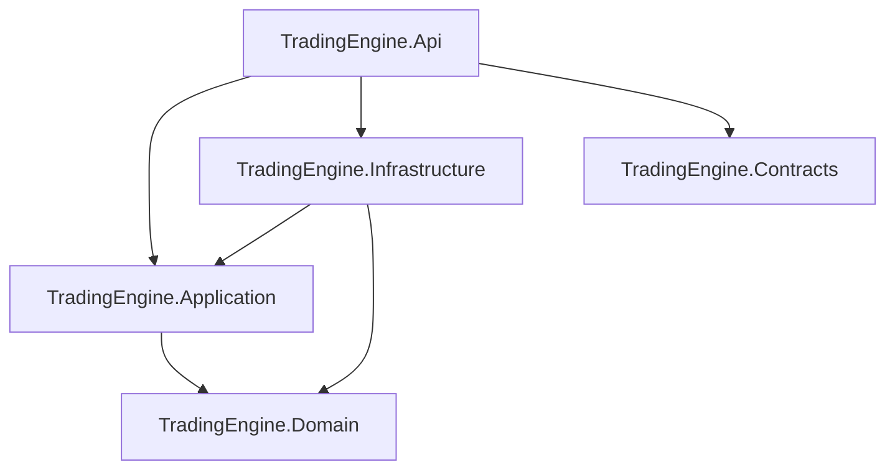

# Solution boundaries and dependency rules

The solution uses Hexagonal Architecture pragmatically. Domain and Application form the reusable core. HTTP is a driving adapter; persistence and external integrations will be driven adapters in Infrastructure. The API project is the composition root.

## Project responsibilities

| Project | Responsibility | Allowed production-project references |
| --- | --- | --- |
| `TradingEngine.Domain` | Entities, value objects, enums and invariants | None |
| `TradingEngine.Application` | Use-case orchestration and use-case-specific ports | Domain |
| `TradingEngine.Infrastructure` | Driven adapters implemented by later stories | Application, Domain |
| `TradingEngine.Contracts` | Stable HTTP and message DTOs | None |
| `TradingEngine.Api` | HTTP driving adapter and composition root | Application, Infrastructure, Contracts |

Contracts are transport-facing types rather than domain types. Domain and Application do not reference Contracts, so transport versioning cannot leak into the core.

## Application conventions

- Organise use cases as small vertical slices under a capability folder, for example `WatchedInstruments/Register`.
- Give each use case a command and a handler. Add a use-case-specific port only when the use case needs an external capability.
- Do not add a generic repository or mediator abstraction without a demonstrated need.
- Application reads the current time through NodaTime `IClock`. It passes the resulting `Instant` into Domain methods explicitly.
- Infrastructure will implement the ports. This story intentionally includes no persistence implementation.

## Domain conventions

- Stable identifiers and constrained codes are validated value objects.
- Absolute timestamps are NodaTime `Instant` values.
- Domain methods never read a system clock.
- State transitions reject invalid or meaningless changes and reject timestamps earlier than the latest recorded change.
- Sampling policy names express intent only. Provider-specific intervals and rate-limit mappings belong outside Domain.

## Monitoring-rule definitions

- A relational monitoring-rule revision owns the business revision number, lifecycle state, effective interval, creation metadata and concurrency state.
- Its variable chart-analysis definition is stored as versioned XML and mapped to a validated Domain model by an Infrastructure adapter.
- The XML persistence schema is independent of versioned HTTP and message contracts. Clients send transport DTOs and do not construct persistence XML.
- Price observations, signals, risk decisions and orders are separate records rather than mutable state inside the definition.
- Effective and superseded definitions are immutable. Schema evolution retains historical readers and writes an upgraded definition only as a new draft business revision.
- Generic schema and synthetic examples are public-safe. Real definitions, meaningful parameters and strategy or execution logic remain private.

See [Chart-analysis definition XML](chart-analysis-definition-xml.md) for the proposed v1 contract.

## Instrument identification

- Domain currently identifies an instrument using its symbol, exchange and quote currency (`InstrumentSymbol`, `ExchangeCode` and `QuoteCurrencyCode`).
- `ExchangeCode` describes the listing exchange for an exchange-listed instrument. It does not describe the broker or provider, and eToro is never represented as the exchange.
- Broker- and provider-specific instrument identifiers are external mappings owned by outbound adapters and Infrastructure, not by Domain.
- Crypto instruments may not have one definitive listing exchange. Exchange optionality and asset classification will be addressed when crypto support is implemented.
- Supported exchanges and currencies may initially be controlled by Application configuration or reference data rather than dedicated persistence.

## Enforcement

`TradingEngine.Architecture.Tests` checks the production project-reference allow-list, the Domain assembly dependencies, forbidden Domain package references and the absence of `IClock` from Domain types. These tests are intentionally narrow and complement compiler-enforced project references.

The forbidden Domain dependency set includes outer Trading Engine layers, ASP.NET Core, Azure SDKs, EF Core and broker-specific packages. NodaTime is the sole intentional third-party Domain dependency in this foundation.

## Build identity

Every project receives a non-sensitive `CommitSha` assembly metadata value. Local builds use `local`; GitHub Actions builds automatically use `GITHUB_SHA`. A manual build can provide `-p:SourceRevisionId=<commit>` explicitly. `/version` returns only the API application name, assembly version and this commit identifier.
