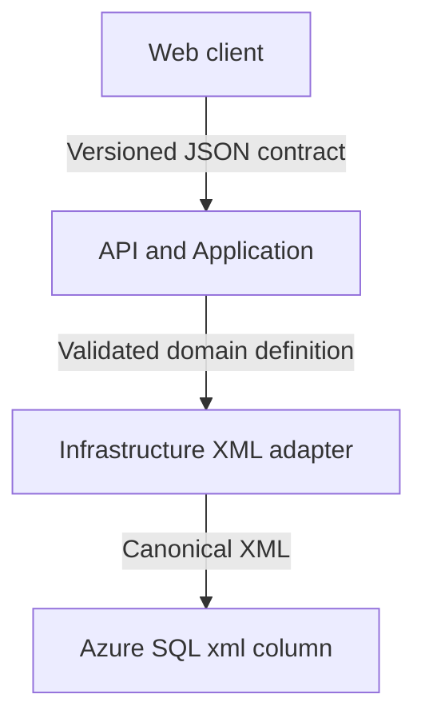

# Chart-analysis definition XML

**Status:** v1 contract implemented by `ChartAnalysisDefinitionXmlSerializer` in `TradingEngine.Infrastructure`

**Related issue:** [#3](https://github.com/carndog/TradingEngine/issues/3)

## Purpose

`ChartAnalysisDefinition` is the canonical XML persistence format for the variable chart-analysis definition held by a monitoring-rule revision. It describes configured chart annotations and the generic conditions to observe. It does not contain observed prices, generated signals, trading strategy, risk decisions or execution state.

The name is deliberately concerned with chart analysis rather than transport or trading. Later schema versions may represent other generic analytical inputs, such as moving averages or volatility bands, without changing the role of the document.

## Architectural boundary

The XML format is independent of the HTTP API contract:



The client does not construct persistence XML. The API maps its transport DTO to a validated Domain model, and Infrastructure serializes that model. API versions and XML schema versions can therefore evolve independently.

An XML import capability may be added separately. Imported XML must be parsed securely, schema-validated, mapped to the Domain model and canonically reserialized before persistence. Raw client XML must never be inserted directly.

## Relationship to the revision timeline

Each relational monitoring-rule revision owns one `ChartAnalysisDefinition` document. The effective timeline selects the applicable relational revision for an `Instant`; its XML is then deserialized using the schema version declared by the document.

| Concern | Representation |
| --- | --- |
| Stable revision identity and business revision number | Relational columns |
| `Draft`, `Effective` and `Superseded` lifecycle | Relational columns |
| Effective interval, creation metadata and change reason | Relational columns |
| Instrument, exchange, currency, monitoring state and sampling policy | Relational columns |
| Support and resistance zones and their generic conditions | `ChartAnalysisDefinition` XML |
| Actual price observations and resulting signals | Separate relational records |
| SQL optimistic concurrency token | Relational `rowversion` |

An effective or superseded revision is immutable. A change creates a new draft revision rather than rewriting the historical XML.

## Version 1 document

The v1 namespace is `urn:carndog:trading-engine:chart-analysis:v1`. The root `schemaVersion` must also be `1`; the namespace and attribute must agree.

```xml
<ChartAnalysisDefinition
    xmlns="urn:carndog:trading-engine:chart-analysis:v1"
    schemaVersion="1"
    priceScale="4">
  <SupportZones>
    <SupportZone id="support-a" lower="95.0000" level="100.0000" upper="105.0000">
      <Condition type="buy-zone" actionId="publish-signal" />
      <Condition type="support-loss" actionId="publish-signal" />
    </SupportZone>
  </SupportZones>
  <ResistanceZones>
    <ResistanceZone id="resistance-a" lower="120.0000" level="125.0000" upper="130.0000">
      <Condition type="breakout" actionId="publish-signal" />
    </ResistanceZone>
  </ResistanceZones>
</ChartAnalysisDefinition>
```

All examples use synthetic values. Real chart-analysis definitions and meaningful parameter values must not be committed to the public repository.

## Price representation

- Prices are decimal values in quote-currency units. There is no implicit conversion from pence, cents or another minor unit.
- Values use invariant XML decimal syntax with a period as the decimal separator and no exponent.
- A price has at most 8 fractional digits and must be representable as a .NET `decimal`.
- `priceScale` is between 0 and 8 and declares the number of fractional digits used by every price in the document.
- Canonical serialization writes every price with exactly `priceScale` fractional digits.
- Every price must be greater than zero.
- Every zone must satisfy `lower < level < upper` after decimal parsing.
- Zone ranges must not overlap. Touching boundaries are also rejected so that a price cannot occupy two zones simultaneously.

The XSD enforces the lexical numeric limits. The serializer and Domain model enforce the shared scale, cross-field ordering and overlap rules. An XML `xs:decimal` value outside the .NET `decimal` range is rejected with `InvalidDataException` at the Infrastructure mapping boundary before persistence.

## Condition semantics

Conditions describe generic chart events. They do not decide position size, order type, stop loss, take profit or whether an order should be executed.

| Condition | Valid location | Becomes true when |
| --- | --- | --- |
| `buy-zone` | Support zone | The previous price was above `upper` and the current price is greater than `level` and less than or equal to `upper` |
| `support-loss` | Support zone | The previous price was greater than or equal to `lower` and the current price is below `lower` |
| `breakout` | Resistance zone | The previous price was less than or equal to `upper` and the current price is above `upper` |

Equality with a boundary remains within the zone. A first observation establishes state and does not produce a crossing condition. Later evaluation work will own deduplication and the durable record of each observation and decision.

Each zone has a stable `id` so a resulting signal can identify the chart feature that produced it. Each condition has a stable `actionId` resolved by an application action registry. The only public v1 example action is `publish-signal`; strategy-specific or execution-specific actions and parameters remain private.

A support zone must contain one `buy-zone` condition followed by one `support-loss` condition. A resistance zone must contain one `breakout` condition. Conditions cannot be duplicated or placed under the wrong zone type.

## Deterministic serialization

The serializer must produce a single canonical representation:

1. Write `SupportZones` before `ResistanceZones`.
2. Order zones by `lower` ascending and then `id` using ordinal comparison.
3. Write support conditions as `buy-zone` followed by `support-loss`.
4. Write attributes in the order shown in the example.
5. Omit the XML declaration, byte-order mark, comments and insignificant whitespace.
6. Use UTF-8 and line-feed characters when XML is rendered outside the SQL `xml` value.

Consumers must compare the parsed meaning rather than depending on attribute order, but deterministic output supports repeatable tests, diagnostics and hashing.

## Validation sequence

Before persistence, the Infrastructure adapter must:

1. Parse with DTD processing prohibited and external resource resolution disabled.
2. Read the root namespace and `schemaVersion`.
3. Reject malformed XML, a mismatched namespace/version pair or an unsupported version.
4. Validate against the embedded XSD for that version.
5. Map to the version-specific XML DTO and then the Domain model.
6. Apply semantic validation, including price scale, boundary ordering, condition placement, uniqueness and zone overlap.
7. Canonically serialize the validated Domain model.

The v1 XSD is stored beside the Infrastructure adapter at `src/TradingEngine.Infrastructure/MonitoringRules/Xml/V1/chart-analysis-definition-v1.xsd` and is embedded in that assembly for validation.

## Schema evolution

`ChartAnalysisDefinitionXmlSerializer` dispatches deserialization on the document's namespace and `schemaVersion` pair. Each supported version has a dedicated embedded XSD and a version-specific reader that maps the document to the current Domain model. A namespace/version pair with no registered reader is rejected with `UnsupportedChartAnalysisSchemaVersionException` before persistence.

Introducing a new schema version means adding a new `vN` namespace, XSD and reader while retaining every previous reader. Supported historical readers remain available so an old revision can be evaluated without altering its stored document.

When a historical definition is used as the basis for an edit, the application reads it into the current Domain model and writes the result to a new draft revision using the latest schema version. It never upgrades the XML held by an effective or superseded revision in place. Changing only the XML schema therefore never permits a historical rule definition to be overwritten.

## Azure SQL persistence

The `DefinitionXml` column of the monitoring-rule revision table is intended to use the Azure SQL `xml` type. The SQL `xml` type preserves the XML information set — the semantic content and document structure — not the identical lexical string: whitespace, attribute order and other lexical details may differ when the value is read back. Code must therefore not depend on SQL returning the byte-for-byte canonical string originally written. After reading, Infrastructure deserializes the stored value into the Domain model and can serialize it canonically again. Equality checks must compare the validated Domain meaning or freshly canonicalized output, and hashing must not depend directly on the raw string returned by SQL.

EF Core maps a `string` property to the Azure SQL `xml` type via `HasColumnType("xml")`; the adapter validates and canonically serializes the document before it reaches the column, so no SQL Server XML schema collection is required. The EF Core mapping, `TradingEngineDbContext` and migrations belong to issue #32 and are not implemented here. Relational concerns such as revision identity, lifecycle, effective boundaries, creation metadata and the `rowversion` concurrency token remain in their own columns, and effective or superseded monitoring-rule revisions remain immutable.

Future indicators remain descriptive chart-analysis inputs. Dynamic stop-loss or take-profit changes depend on current evaluation, risk and execution state and therefore belong in later signal, risk and order workflows rather than being written repeatedly into this immutable XML. Sampling cadence remains a relational sampling-policy concern and can change without an XML schema change.

## Version 1 scope

Version 1 deliberately contains only:

- Support and resistance zones.
- `buy-zone`, `support-loss` and `breakout` conditions.
- Stable zone and action identifiers.
- Price-format metadata.

Historical prices, generated signals, trade intents, orders, credentials, execution mode and proprietary strategy parameters are outside this document.
